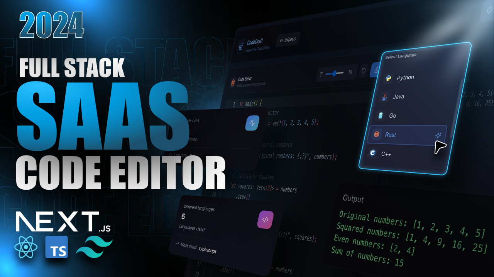

# ✨ CodeCraft - SaaS Code Editor

A full-featured cloud-based code editor SaaS application built with Next.js 15, Convex, Clerk, and TypeScript.



## 🚀 Tech Stack

- **Frontend:** Next.js 15, TypeScript, Tailwind CSS
- **Backend/Database:** Convex (real-time backend)
- **Authentication:** Clerk
- **Code Editor:** Monaco Editor
- **Payments:** Lemon Squeezy
- **State Management:** Zustand

## ✨ Features

- 💻 Online IDE with multi-language support (10 languages: JavaScript, TypeScript, Python, Java, C++, C#, Go, Rust, Ruby, Swift)
- 🎨 5 customizable VSCode themes
- ✅ Smart output handling with Success & Error states
- 💎 Free & Pro pricing plans via Lemon Squeezy
- 🤝 Community code sharing system
- 🔍 Advanced filtering & search for snippets
- 👤 Personal profile with execution history tracking
- 📊 Statistics dashboard
- ⚙️ Customizable font size controls
- 🔗 Webhook integration (Clerk + Lemon Squeezy)

## 📦 Setup

### 1. Clone the repository

```bash
git clone https://github.com/yourusername/code-craft.git
cd code-craft
```

### 2. Install dependencies

```bash
npm install
```

### 3. Configure environment variables

Copy `.env.example` to `.env.local` and fill in your values:

```bash
cp .env.example .env.local
```

```env
NEXT_PUBLIC_CLERK_PUBLISHABLE_KEY=
CLERK_SECRET_KEY=
CONVEX_DEPLOYMENT=
NEXT_PUBLIC_CONVEX_URL=
```

### 4. Set up Convex

```bash
npx convex dev
```

Add these to your **Convex Dashboard** environment variables:

```
CLERK_WEBHOOK_SECRET=
LEMON_SQUEEZY_WEBHOOK_SECRET=
```

### 5. Run the development server

```bash
npm run dev
```

Open [http://localhost:3000](http://localhost:3000) in your browser.

## 🗂️ Project Structure

```
code-craft/
├── convex/                  # Convex backend (DB schema, queries, mutations)
│   ├── schema.ts
│   ├── users.ts
│   ├── snippets.ts
│   ├── codeExecutions.ts
│   └── http.ts              # Webhook handlers
├── src/
│   ├── app/
│   │   ├── (root)/          # Main editor page
│   │   │   └── _components/ # EditorPanel, Header, OutputPanel, etc.
│   │   ├── pricing/         # Pricing page with Lemon Squeezy integration
│   │   ├── profile/         # User profile & execution history
│   │   └── snippets/        # Community snippets browser & detail view
│   ├── components/          # Shared components (Footer, NavigationHeader)
│   ├── hooks/               # Custom React hooks
│   ├── store/               # Zustand state (code editor store)
│   └── types/               # TypeScript type definitions
└── public/                  # Language icons and assets
```

## 🌐 Deployment

Deploy to Vercel:

```bash
npm run build
```

Or connect your GitHub repo to Vercel for automatic deployments.

## 📄 License

MIT License — see [LICENSE](./LICENSE) for details.
